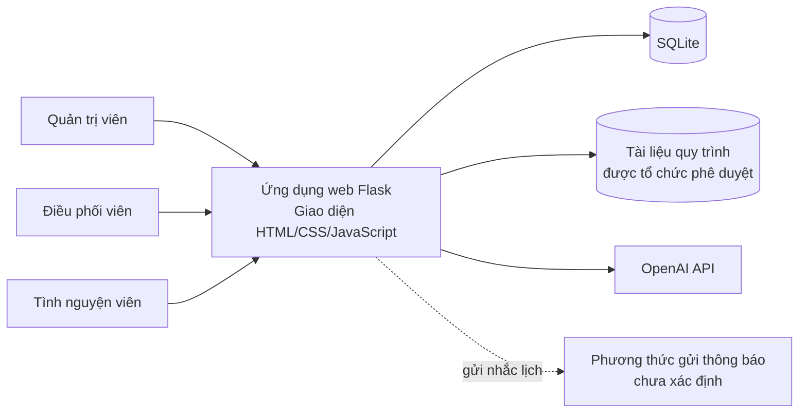
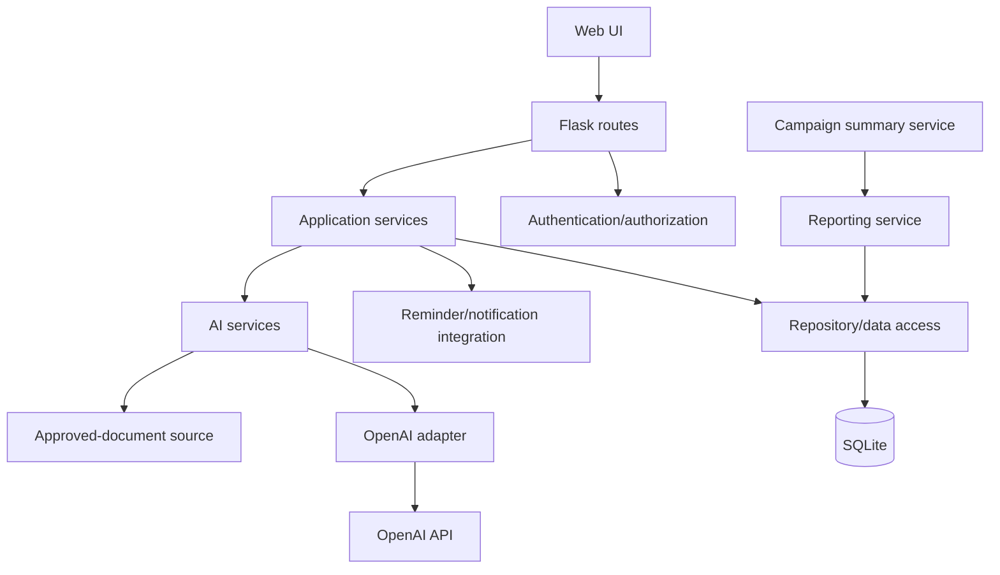

# Architecture Design — Hệ thống quản lý hiến máu tình nguyện có tích hợp AI

## Trạng thái và baseline

- Trạng thái: **bản đề xuất, chưa được con người phê duyệt**.
- Cơ sở: requirements project và các yêu cầu được cung cấp trong hội thoại. Các requirement issue còn mở phải được giải quyết trước khi khóa thiết kế.
- Phạm vi: hệ thống web dùng Flask, giao diện HTML/CSS/JavaScript, SQLite và OpenAI API theo công nghệ dự kiến. Không xác định thêm hạ tầng triển khai.
- Nguồn requirements: `docs/01-requirements.md`, `docs/requirements.md` nếu đã được xác minh/duyệt. ID được dùng theo bản phân tích hiện có: FR-001–FR-012, NFR-001–NFR-008. Nếu baseline chính thức đổi, cần đồng bộ traceability.

## Architectural style

**Modular monolith, phân lớp trong một ứng dụng Flask.** Các module nghiệp vụ nằm trong cùng ứng dụng để phù hợp quy mô project sinh viên và SQLite; tách giao diện HTTP, xử lý nghiệp vụ, lưu trữ và tích hợp OpenAI theo trách nhiệm. Không đề xuất microservices, message broker hay nền tảng triển khai riêng vì requirements hiện không yêu cầu.

## Context và boundary

OpenAI API và kênh gửi thông báo là ranh giới bên ngoài. Kênh gửi chưa được chỉ định, nên `Notify` chỉ thể hiện một điểm tích hợp cần quyết định, không khẳng định email/SMS hay dịch vụ cụ thể.

## Components và trách nhiệm

| Component | Trách nhiệm | Requirement liên quan |
|---|---|---|
| Web UI | Hiển thị trang đăng nhập, luồng quản lý, đăng ký, thông báo, thống kê và chatbot theo yêu cầu; hiển thị cảnh báo AI phù hợp. Không tự quyết định quyền nghiệp vụ. | FR-001–FR-012 |
| Flask routes / presentation | Nhận HTTP request, xác thực dữ liệu đầu vào ở biên, gọi application services và trả response/view. Không chứa quy tắc sức chứa hoặc prompt logic. | FR-001–FR-012 |
| Authentication & authorization | Xử lý đăng nhập và kiểm tra vai trò Admin, Coordinator, Volunteer trên các thao tác. Ma trận quyền chưa được quyết định nên enforcement chi tiết còn phụ thuộc ISSUE-001. | FR-001 |
| Registrant service | Quản lý hồ sơ người đăng ký và thông tin liên hệ trong phạm vi được duyệt. | FR-002 |
| Campaign/location/schedule service | Quản lý chiến dịch, điểm hiến, thời gian và khung giờ. | FR-003, FR-004/FR-005 tùy baseline |
| Registration & capacity service | Ghi nhận đăng ký theo khung giờ và bảo đảm không vượt sức chứa đã định. Giá trị giới hạn, cạnh tranh đồng thời và phản hồi khi đầy cần được chốt. | FR-004 |
| Participation & blood type service | Ghi nhận trạng thái tham gia và nhóm máu demo. Không diễn giải dữ liệu demo thành đánh giá y tế. | FR-005, FR-006 |
| Reminder/notification service | Tạo yêu cầu gửi nhắc lịch tới người đăng ký và phối hợp với phương thức gửi khi được xác định. Kênh, lịch gửi, trạng thái gửi chưa được chốt. | FR-007 |
| Reporting service | Tổng hợp số người đăng ký, lượt tham gia và thống kê nhóm máu theo định nghĩa được duyệt. | FR-008 |
| AI notification service | Gửi thông tin chiến dịch cần thiết tới AI để tạo thông báo mời hoặc nhắc lịch; trả nội dung sinh ra cho luồng thông báo. Gửi tự động hay cần duyệt còn mở. | FR-009 |
| Grounded Q&A service | Lấy ngữ cảnh từ tài liệu quy trình đã duyệt, gửi câu hỏi và ngữ cảnh cần thiết tới OpenAI API, kiểm tra kết quả trong phạm vi, và trả lời hoặc từ chối khi tài liệu không có thông tin. | FR-010, NFR-006 |
| Campaign summary service | Chuẩn bị số liệu tổng hợp chiến dịch (không gửi hồ sơ cá nhân không cần thiết), yêu cầu AI tạo tóm tắt và trả kết quả cho điều phối viên xem xét. | FR-011, NFR-007, NFR-008 |
| Repository/data access | Đọc/ghi dữ liệu ứng dụng trong SQLite; các module nghiệp vụ không truy vấn cơ sở dữ liệu trực tiếp từ route. | FR-002–FR-008 |
| OpenAI adapter | Bao bọc lời gọi OpenAI API, cấu hình lấy từ `.env`, không chứa API key trong source. | FR-009–FR-011, NFR-004 |
| Approved-document source | Cung cấp đúng tài liệu quy trình được tổ chức phê duyệt cho chatbot. Quy trình phê duyệt, định dạng và phiên bản cần làm rõ. | FR-010 |

Tên component là phân rã kiến trúc đề xuất, không tự thêm chức năng người dùng. Cấu trúc package/file cụ thể thuộc giai đoạn implementation.

## Dependencies

- Route chỉ phụ thuộc vào services, không truy cập SQLite hay OpenAI trực tiếp.
- AI nghiệp vụ gọi adapter để cô lập phụ thuộc nhà cung cấp; adapter là thành phần bên trong ứng dụng, OpenAI API là external system.
- Grounded Q&A phụ thuộc tài liệu được duyệt; không có tài liệu/ngữ cảnh hỗ trợ thì đi nhánh từ chối.
- Reporting tạo số liệu tổng hợp; Campaign summary chỉ nhận phần tổng hợp cần thiết.
- Notification delivery adapter chưa thể chọn do kênh gửi chưa được yêu cầu cụ thể.

## Communication

- Actor truy cập ứng dụng web qua HTTP/HTTPS; giao thức triển khai thực tế cần xác định ở giai đoạn vận hành.
- Flask routes gọi application services đồng bộ trong cùng tiến trình ứng dụng.
- Repository đọc/ghi SQLite.
- Các chức năng AI gửi request/nhận response đồng bộ qua OpenAI API theo nhu cầu tương tác. Giới hạn timeout, retry và xử lý lỗi chưa được requirement xác định.
- Nhắc lịch cần giao tiếp với kênh gửi bên ngoài hoặc cơ chế hiển thị trong ứng dụng; chưa đủ thông tin để chọn cách giao tiếp.

## Data flows

### Đăng nhập và quản lý

Actor → Web UI → Flask routes → xác thực/phân quyền → service nghiệp vụ → repository → SQLite → response về UI. Mọi thao tác quản lý phải qua kiểm tra quyền; chi tiết ai được làm gì phụ thuộc ISSUE-001.

### Đăng ký khung giờ

Tình nguyện viên → chọn chiến dịch/khung giờ → Registration & capacity service → kiểm tra số đăng ký hiện có so với sức chứa → lưu đăng ký trong SQLite → phản hồi kết quả. Quy tắc sức chứa và phản hồi khi đầy cần quyết định tại issue liên quan; kiến trúc không đặt con số mặc định.

### Nhắc lịch và AI sinh thông báo

Thông tin chiến dịch/lịch cần thiết → AI notification service (nếu cần tạo văn bản) → OpenAI adapter → OpenAI API → nội dung thông báo → luồng notification. Reminder service gửi thông báo đến người đăng ký qua kênh chưa xác định. Không gửi thông tin sức khỏe cá nhân vào prompt. Việc tự động gửi hay con người duyệt trước cần được quyết định.

### Chatbot quy trình

Người dùng gửi câu hỏi → Grounded Q&A service truy xuất tài liệu tổ chức đã duyệt → chỉ gửi câu hỏi và đoạn tài liệu liên quan cần thiết qua OpenAI adapter → kiểm tra câu trả lời theo phạm vi → trả lời theo tài liệu hoặc thông báo thông tin chưa có trong tài liệu được duyệt. Không chẩn đoán bệnh, tư vấn y khoa cá nhân, hoặc kết luận cá nhân có đủ điều kiện hiến máu hay không. Câu hỏi vượt tài liệu đi nhánh từ chối.

### Tóm tắt chiến dịch

Reporting service tổng hợp số lượng/lượt tham gia/nhóm máu → Campaign summary service gửi dữ liệu tổng hợp cần thiết qua OpenAI adapter → OpenAI API tạo tóm tắt → kết quả hiển thị cho điều phối viên. Không gửi hồ sơ cá nhân không cần thiết. Kết quả AI cần được con người kiểm tra; cách ghi nhận bước kiểm tra còn cần chốt.

## External systems

| External system | Mục đích | Dữ liệu qua boundary | Trạng thái |
|---|---|---|---|
| OpenAI API | Sinh thông báo, hỏi đáp có grounding và tóm tắt chiến dịch | Thông tin chiến dịch cần thiết, câu hỏi và trích đoạn tài liệu duyệt, số liệu tổng hợp | Công nghệ được dự kiến; mô hình, chính sách lưu giữ và cấu hình chi tiết cần xác minh |
| Notification delivery channel | Gửi nhắc lịch tới người đăng ký | Nội dung thông báo và thông tin định tuyến cần thiết | Chưa xác định; không chọn nhà cung cấp/kênh thay người dùng |

## Security and privacy boundaries

- **Actor ↔ ứng dụng:** yêu cầu đăng nhập và vai trò được nêu; cần quyết định ma trận quyền trước khi chi tiết hóa authorization.
- **Ứng dụng ↔ SQLite:** thông tin người đăng ký, liên hệ, lịch và dữ liệu chiến dịch nằm trong boundary dữ liệu ứng dụng. Trường cá nhân, quyền truy cập, lưu giữ và xóa cần được quyết định.
- **Ứng dụng ↔ OpenAI API:** đây là boundary ra ngoài. Chỉ gửi dữ liệu cần thiết cho tác vụ; không gửi dữ liệu cá nhân nhạy cảm không cần thiết. API key lấy từ `.env`, không hard-code.
- **Chatbot:** tài liệu đã được tổ chức phê duyệt là nguồn kiến thức cho quy trình. Không dùng câu trả lời mô hình làm nguồn thay thế khi thiếu tài liệu. Hạn chế y khoa và refusal phải được giữ ở service/UI.
- **AI output:** đầu ra không mặc định chính xác. Quy trình kiểm tra của con người cần áp dụng, đặc biệt với thông báo và tóm tắt, theo quyết định sẽ được ghi nhận.
- **Notification boundary:** chỉ gửi thông tin cần thiết cho người nhận; kênh và dữ liệu nhận dạng cần thiết chưa được xác định.

Các mục trên mô tả ranh giới kiến trúc; không khẳng định các biện pháp vận hành hoặc tuân thủ chưa có trong requirements.

## Requirement-to-architecture traceability

| Requirement | Thành phần / luồng kiến trúc |
|---|---|
| FR-001 | Web UI, Flask routes, Authentication & authorization |
| FR-002 | Registrant service, Repository/data access, SQLite |
| FR-003 | Campaign/location/schedule service, Repository/data access, SQLite |
| FR-004 | Registration & capacity service, Repository/data access, SQLite |
| FR-005–FR-006 | Participation & blood type service, Repository/data access, SQLite |
| FR-007 | Reminder/notification service, notification boundary (kênh còn mở) |
| FR-008 | Reporting service, Repository/data access, SQLite |
| FR-009 | AI notification service, OpenAI adapter, OpenAI API |
| FR-010 | Grounded Q&A service, Approved-document source, OpenAI adapter, refusal path |
| FR-011 | Reporting service, Campaign summary service, OpenAI adapter |
| FR-012 | Web UI / hiển thị cảnh báo AI |
| NFR-001 | Flask routes và application services trên Python/Flask |
| NFR-002 | Web UI HTML/CSS/JavaScript |
| NFR-003 | Repository/data access và SQLite |
| NFR-004 | OpenAI adapter và cấu hình secret từ `.env` |
| NFR-005 | Ngoài phạm vi kiến trúc runtime; kiểm thử bao phủ các component ở giai đoạn testing |
| NFR-006 | Grounded Q&A service, tài liệu duyệt, refusal path và UI cảnh báo |
| NFR-007 | AI services, data minimization tại OpenAI boundary |
| NFR-008 | Human review đối với AI output; quy trình chi tiết còn chờ quyết định |

## Requirement issues affecting architecture

Quyền từng vai trò; sức chứa và concurrent registration; định nghĩa trạng thái; kênh/lịch nhắc; công thức báo cáo; phê duyệt thông báo AI; quản trị tài liệu duyệt; dữ liệu cá nhân được thu thập/lưu/xóa; kiểm tra đầu ra AI; và cách triển khai đều cần được giải quyết trước khi architecture baseline được chấp nhận. Tham chiếu `docs/requirements-issues.md` nếu file này có trong baseline.
