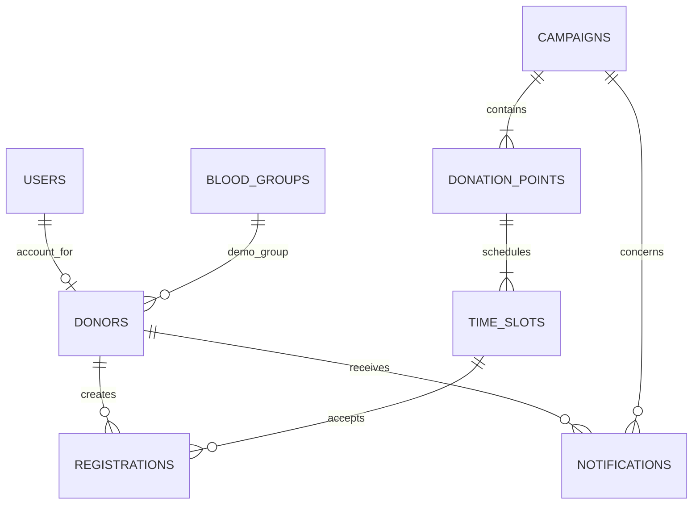

# Database Design — Hệ thống quản lý hiến máu tình nguyện có tích hợp AI

## Trạng thái và nguồn

- Trạng thái: **đề xuất, cần con người xác minh**.
- Cần đối chiếu baseline tại `docs/requirements.md` và `docs/architecture.md`. Công cụ workspace hiện không cho phép đọc lại hai file; thiết kế này dựa trên requirements/architecture đã có trong hội thoại và các ràng buộc cụ thể ở yêu cầu database.
- DBMS: SQLite.
- DDL: `database/schema.sql`.
- Không viết Flask source code.

## Requirements được ánh xạ

| Yêu cầu | Dữ liệu liên quan |
|---|---|
| Đăng nhập, ba vai trò | `users` |
| Hồ sơ và thông tin liên hệ người đăng ký | `donors` |
| Chiến dịch, nhiều điểm hiến | `campaigns`, `donation_points` |
| Điểm hiến có nhiều khung giờ, khung giờ có sức chứa | `donation_points`, `time_slots` |
| Người đăng ký khung giờ, đăng ký có trạng thái | `registrations` |
| Nhóm máu demo | `blood_groups`, `donors.blood_group_id` |
| Gửi thông báo | `notifications` |
| Chatbot dùng tài liệu đã được duyệt | `approved_documents` |
| AI tóm tắt dựa trên số liệu tổng hợp | Query/aggregate từ bảng nghiệp vụ; không lưu prompt/response AI |

## Entities

| Entity | Vai trò | Ghi chú |
|---|---|---|
| `users` | Tài khoản đăng nhập với một trong ba vai trò | `username` định danh đăng nhập; lưu hash mật khẩu, không lưu mật khẩu gốc. |
| `donors` | Hồ sơ tối thiểu của tình nguyện viên/người đăng ký | Tách thông tin liên hệ khỏi tài khoản. Việc mọi tình nguyện viên có tài khoản là giả định chờ xác nhận. |
| `campaigns` | Chiến dịch hiến máu | Một chiến dịch chứa nhiều điểm hiến. |
| `donation_points` | Điểm hiến thuộc một chiến dịch | Không giả định một điểm có thể dùng chung cho nhiều chiến dịch. |
| `time_slots` | Khung giờ thuộc một điểm hiến, có giới hạn đăng ký | `capacity` phải dương; đơn vị là số lượt đăng ký. |
| `registrations` | Đăng ký của người hiến vào khung giờ và trạng thái hiện tại | Chưa đưa quy tắc chống đăng ký trùng vào UNIQUE vì chưa có yêu cầu cụ thể. |
| `blood_groups` | Danh mục nhóm máu demo ABO/Rh | Không phải kết quả y tế đã xác minh. |
| `notifications` | Nội dung thông báo gắn người nhận và chiến dịch | Kênh gửi, lịch gửi, trạng thái gửi chưa được quy định nên không thêm cột giả định cho các khái niệm đó. |
| `approved_documents` | Tham chiếu tài liệu chatbot và trạng thái được duyệt | Chỉ tài liệu có `is_approved = 1` được dùng làm nguồn chatbot. Cơ chế phê duyệt/phiên bản chưa được mô tả. |

### Không tạo bảng `participation_records` ở bản này

Yêu cầu hiện có ghi nhận trạng thái tham gia trên đăng ký, vì vậy trạng thái đang được lưu tại `registrations.status`. Tạo thêm bảng participation riêng sẽ lặp trạng thái hoặc ngầm thêm lịch sử tham gia. Nếu cần lưu nhiều lần cập nhật/audit, phải có requirement được duyệt trước.

## Relationships

`users`–`donors` 1:0..1 là giả định triển khai để gắn tài khoản volunteer với hồ sơ; xác nhận tại DB-ISSUE-001. Mỗi donation point thuộc một campaign theo model tối thiểu. Nếu điểm hiến được dùng chung giữa chiến dịch, cần quan hệ nhiều-nhiều và bảng liên kết sau khi được xác nhận.

## Normalization

- Mỗi bảng biểu diễn một loại thực thể; các trường là giá trị đơn, không lưu danh sách điểm/khung giờ trong một cột.
- Điểm hiến và khung giờ được tách để campaign có nhiều điểm, điểm có nhiều khung giờ.
- Nhóm máu được chuẩn hóa thành bảng tra cứu, tránh lặp chuỗi tự do trong hồ sơ; chỉ chứa dữ liệu demo.
- Thông tin tài khoản được tách khỏi thông tin hồ sơ/liên hệ.
- Không lưu sẵn thống kê chiến dịch hoặc AI summary; chúng có thể tính từ số liệu đăng ký và nhóm máu theo định nghĩa thống kê được duyệt.
- Không có denormalization đề xuất.

## Keys, data types, constraints, indexes

Chi tiết đầy đủ nằm trong DDL. PK dùng `INTEGER PRIMARY KEY` tương thích SQLite. FK dùng `ON DELETE RESTRICT` để không xóa dây chuyền hồ sơ/lịch sử; quy trình xóa dữ liệu cần policy riêng. Bật FK enforcement bằng `PRAGMA foreign_keys = ON` trên mọi connection.

| Table | PK / FK | NOT NULL / UNIQUE / CHECK | Index |
|---|---|---|---|
| `users` | PK `user_id` | username, password hash, role, created_at NOT NULL; username UNIQUE; role CHECK theo ba actor | Role index |
| `donors` | PK `donor_id`; FK user, blood group | user_id UNIQUE; required name, optional email/phone/blood group. Không áp UNIQUE email/phone vì yêu cầu chưa cấm liên hệ chung | FK blood group |
| `campaigns` | PK `campaign_id` | name, start/end datetime; CHECK end > start | start time |
| `donation_points` | PK `donation_point_id`; FK campaign | campaign/name/address NOT NULL | campaign FK |
| `time_slots` | PK `time_slot_id`; FK donation point | start/end/capacity NOT NULL; CHECK end > start, capacity > 0 | point + start time |
| `registrations` | PK `registration_id`; FKs donor, slot | status NOT NULL và không rỗng; không có enum CHECK vì giá trị trạng thái còn chưa rõ | donor FK; slot + status |
| `blood_groups` | PK `blood_group_id` | ABO/Rh NOT NULL; UNIQUE ABO+Rh; CHECK giá trị ABO/Rh theo yêu cầu demo | unique pair index |
| `notifications` | PK `notification_id`; FKs donor, campaign | type/content/created_at NOT NULL; CHECK type invitation/reminder | donor FK; campaign FK |
| `approved_documents` | PK `document_id` | title/path/approval flag NOT NULL; CHECK flag 0/1 | approval flag |

SQLite affinity `TEXT` dùng cho tên, nội dung, định danh và datetime ISO-8601; `INTEGER` dùng cho khóa, sức chứa và boolean dạng 0/1. Hạn chế so sánh datetime dạng chuỗi bằng ISO-8601 thống nhất; định dạng/múi giờ cần chốt ở requirements.

## Privacy and data minimization

- `donors` chỉ lưu tên và phương thức liên hệ cần để quản lý người đăng ký; email/điện thoại để nullable vì chưa biết kênh liên hệ bắt buộc. Không thêm ngày sinh, địa chỉ nhà, bệnh sử, kết quả xét nghiệm hoặc điều kiện sức khỏe.
- Nhóm máu chỉ lưu ở phạm vi demo theo yêu cầu; không dùng để suy luận đủ điều kiện hiến máu.
- Chỉ lưu hash mật khẩu, tuyệt đối không lưu mật khẩu gốc.
- Không có bảng chat history, prompt, response hoặc payload OpenAI. AI summary tính từ aggregate thay vì hồ sơ cá nhân.
- Thời hạn lưu, quyền xem/sửa, xóa/anonymize dữ liệu và yêu cầu đồng ý chưa được quy định; xem DB-ISSUE-004.

## Ambiguities and assumptions

| ID | Nội dung | Hệ quả |
|---|---|---|
| DB-ISSUE-001 | Có phải mọi tình nguyện viên/người đăng ký đều có tài khoản `users`? | Quan hệ user-donor hiện là 1:0..1; có thể cần tài khoản tùy chọn hoặc hồ sơ không tài khoản. |
| DB-ISSUE-002 | Bộ trạng thái đăng ký chính xác là gì? Tài liệu trước có giá trị chưa rõ “Hủy/Tải về”. | `status` là TEXT NOT NULL chưa có enum CHECK hay default. Cần quyết định giá trị và chuyển trạng thái. |
| DB-ISSUE-003 | Có cho một người đăng ký cùng khung giờ nhiều lần hoặc nhiều khung giờ không? | Chưa đặt `UNIQUE(donor_id, time_slot_id)` và chưa đặt uniqueness toàn campaign. |
| DB-ISSUE-004 | Trường liên hệ bắt buộc nào, retention, quyền truy cập, xóa dữ liệu ra sao? | Email/phone nullable; chưa có cascade delete, audit hay retention policy. |
| DB-ISSUE-005 | Khung giờ có luôn thuộc đúng một điểm của đúng một chiến dịch không? Điểm hiến có được tái dùng giữa campaigns? | Schema gắn time slot vào donation point và point vào một campaign; không có campaign_id lặp ở slot. |
| DB-ISSUE-006 | Tỷ lệ thống kê nhóm máu tính theo người đăng ký hay người tham gia thực tế? | Không lưu bảng summary; query/report cần dùng định nghĩa được duyệt. |
| DB-ISSUE-007 | Kênh và nội dung cần thiết để gửi notification là gì? Cần lưu trạng thái gửi/lịch gửi không? | Không có provider, delivery status hay scheduled_at trong schema. |
| DB-ISSUE-008 | Quy trình duyệt tài liệu, định dạng, versioning, approver và ngày duyệt cần lưu gì? | `approved_documents` hiện chỉ có cờ được duyệt và đường dẫn/tên; chatbot phải lọc cờ duyệt. |
| DB-ISSUE-009 | Có cần lưu lịch sử cập nhật trạng thái tham gia không? | Không tạo `participation_records`/audit history để tránh thêm nghiệp vụ. |
| DB-ISSUE-010 | Quy tắc sức chứa phải tính trạng thái nào là chỗ đang chiếm; xử lý đăng ký đồng thời ra sao? | DDL giữ capacity > 0, nhưng không thể biểu diễn động capacity invariant bằng CHECK liên bảng. Cần transaction/application rule và test ở implementation. |
| DB-ISSUE-011 | Quy tắc xóa campaign/point/slot/donor khi có đăng ký liên quan? | FK `RESTRICT` được đề xuất để ngăn xóa dây chuyền; lifecycle cần xác nhận. |

## Verification report

| Kiểm tra | Trạng thái | Ghi chú |
|---|---|---|
| PK mỗi bảng | Đạt theo DDL | Mỗi bảng có `INTEGER PRIMARY KEY`. |
| FK và quan hệ | Đạt theo DDL | Liên kết donor, campaign, point, slot và lookup được khai báo. |
| NOT NULL | Đạt có điều kiện | Trường cốt lõi bắt buộc; contact tùy chọn đang chờ quyết định. |
| UNIQUE | Đạt có điều kiện | username, user-donor link và ABO/Rh pair; chưa áp unique đăng ký trùng. |
| CHECK | Đạt có điều kiện | Vai trò, ABO/Rh, capacity, ngày giờ, notification type, boolean duyệt; status chưa enum do issue. |
| Indexes | Đạt theo thiết kế | FK và truy vấn tra cứu được index; không thêm index không có use case. |
| Data types | Đạt theo SQLite affinity | Ngày giờ là ISO-8601 TEXT; quy ước chuẩn hóa cần chốt. |
| Normalization | Đạt theo phân tích | Không lưu aggregate/AI output hoặc lặp danh sách trong cột. |
| Dữ liệu cá nhân | Đạt nguyên tắc minimization | Chỉ tên, liên hệ và nhóm máu demo; policy lưu/xóa còn mở. |
| Capacity invariant | Chưa thể đảm bảo bằng DDL đơn thuần | Cần transaction/service logic và kiểm thử; không thể CHECK số registrations liên bảng. |
| SQL syntax execution | Chưa xác minh | Workspace/SQLite runtime không truy cập được trong lượt này; DDL cần được chạy trên SQLite trước khi chấp nhận. |
| Requirements traceability | Tạm đạt theo nguồn sẵn có | Không thể đọc lại `docs/requirements.md` và `docs/architecture.md` do lỗi workspace; cần đối chiếu IDs khi môi trường hoạt động. |

## Human decisions required before implementation

Resolve DB-ISSUE-001 through DB-ISSUE-011 where applicable. Especially confirm status values, account-to-donor relationship, contact fields and retention, whether repeated registration is allowed, and notification/document lifecycle. Do not treat this proposed schema as an approved baseline until reviewed.
